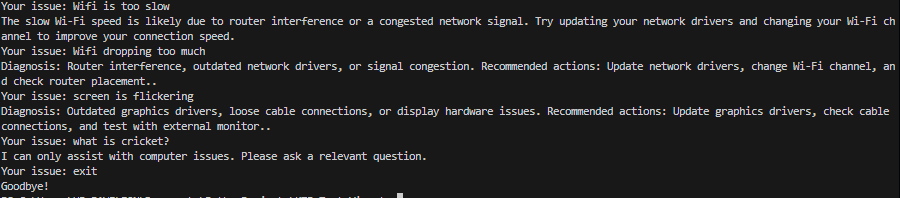
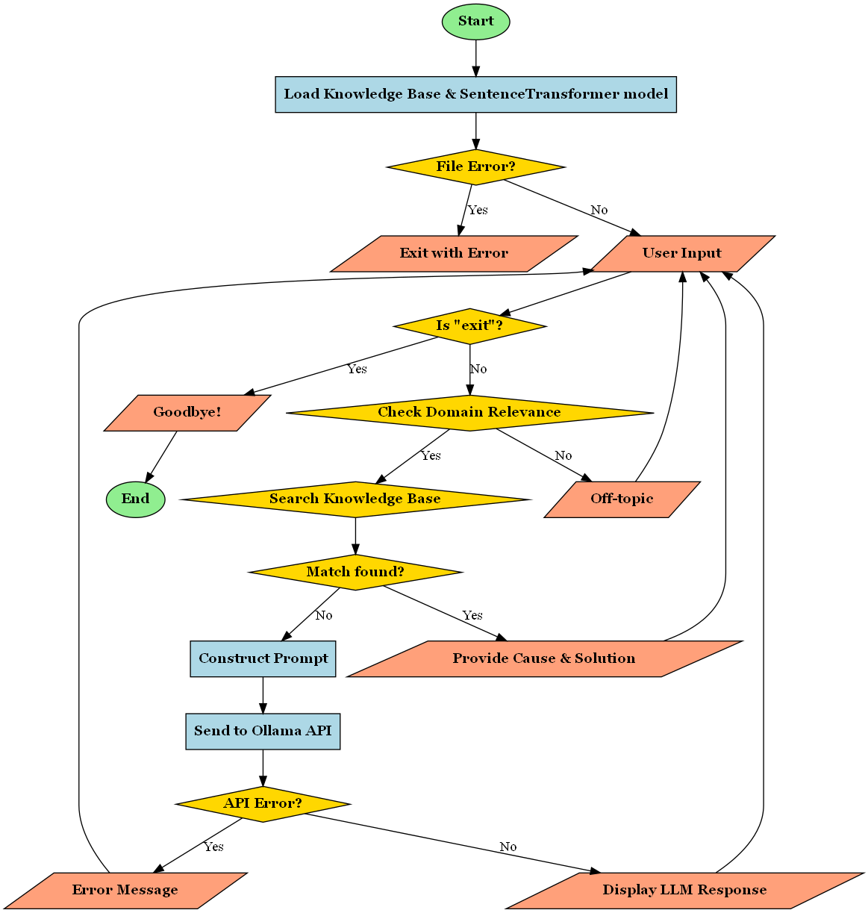

# Computer Diagnostics Chatbot

## Project Description
This is an intelligent diagnostic chatbot designed to help users troubleshoot computer issues using advanced natural language processing techniques. The chatbot combines semantic search with a local language model to provide targeted technical support for various computer problems.


 


## Key Features
- **Semantic Matching**: Utilizes sentence transformers to understand and match user issues
- **Intelligent Diagnosis**: Provides cause and solution for computer-related problems
- **Dual-Approach Diagnostics**:
  1. Local knowledge base matching
  2. Fallback to local language model for complex queries
- **Domain Relevance Checking**: Ensures queries are related to computer issues

## Technical Architecture
### Components
- **Semantic Matching Engine**: 
  - Uses `SentenceTransformer` with `all-MiniLM-L6-v2` model
  - Computes semantic embeddings for user queries and knowledge base
- **Similarity Matching**:
  - Cosine similarity calculation
  - On-topic threshold: 0.2
  - Knowledge base match threshold: 0.7
- **Language Model Integration**:
  - Uses Ollama API for advanced query handling
  - Model: `gemma3`


 

## Prerequisites
### System Requirements
- Python 3.7+
- Local Ollama server running

### Required Python Libraries
- `sentence_transformers`
- `scikit-learn`
- `requests`
- `json`

## Installation

### 1. Clone the Repository
```bash
git clone https://github.com/nirantbendale/computer-diagnostics-chatbot.git
cd computer-diagnostics-chatbot
```

### 2. Install Dependencies
```bash
# Create a virtual environment (recommended)
python -m venv venv
source venv/bin/activate  # On Windows, use `venv\Scripts\activate`

# Install required packages
pip install sentence-transformers scikit-learn requests
```

### 3. Setup Ollama
- Download and install Ollama from [ollama.ai](https://ollama.ai)
- Pull the Gemma 3 model:
```bash
ollama pull gemma3
```

## Configuration
### Knowledge Base
- The `knowledge_base.json` contains 14 predefined computer troubleshooting scenarios
- Covers issues including:
  - Performance problems
  - System crashes
  - Network issues
  - Hardware diagnostics
  - Software conflicts

### Customization
- Modify `knowledge_base.json` to add or update troubleshooting scenarios
- Adjust similarity thresholds in the script for more or less strict matching

## Usage

### Running the Chatbot
```bash
python task2-llm.py
```

### Interaction Example
```
Welcome to the Computer Diagnostics Chatbot!
Describe your computer issue, or type 'exit' to quit.

Your issue: My computer is running very slowly
Diagnosis: Too many background processes, low RAM, or fragmented hard drive. 
Recommended actions: Close unnecessary applications, upgrade RAM, and run disk defragmentation.
```

## Limitations and Considerations
- Requires local Ollama server running
- Diagnostic accuracy depends on knowledge base comprehensiveness
- May not cover extremely rare or specific technical issues
- Relies on semantic matching, so some nuanced issues might be missed

## Troubleshooting
- Ensure Ollama server is running on `http://127.0.0.1:11434`
- Check Python and library versions
- Verify `knowledge_base.json` is in the same directory

## Future Improvements
- Expand knowledge base
- Implement more sophisticated NLP techniques
- Add logging and error tracking
- Create a web or GUI interface

## Contributing
### How to Contribute
1. Fork the repository
2. Create a new branch (`git checkout -b feature/improve-diagnostics`)
3. Add/modify knowledge base or improve matching algorithm
4. Submit a pull request

### Contribution Guidelines
- Maintain existing JSON structure
- Provide clear, concise diagnostic information
- Test thoroughly before submitting

## License
[Specify your license here - e.g., MIT, Apache 2.0]

## Contact
[Your contact information or project maintainer details]
